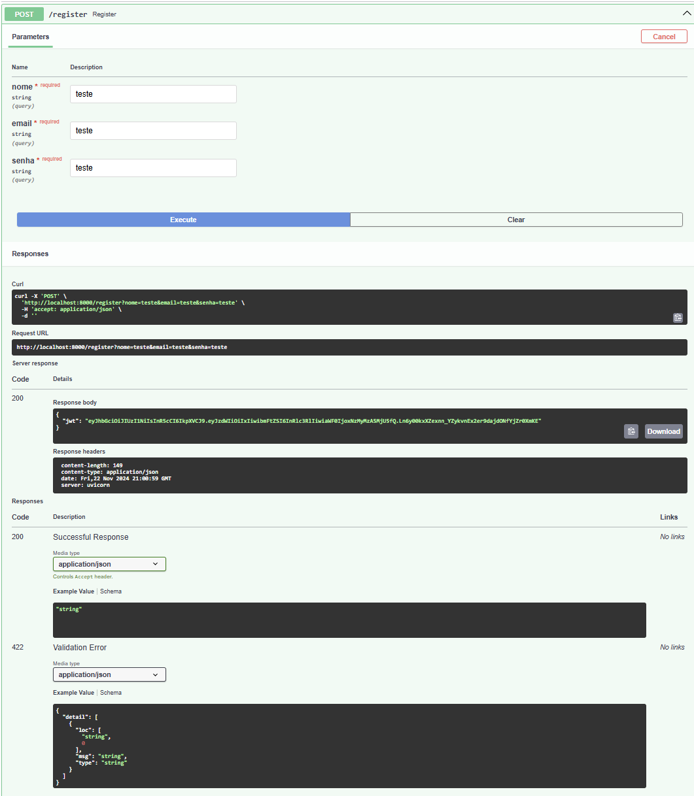
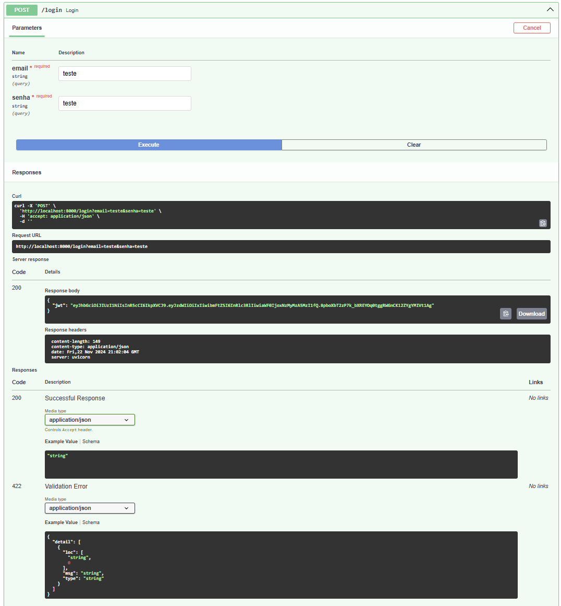
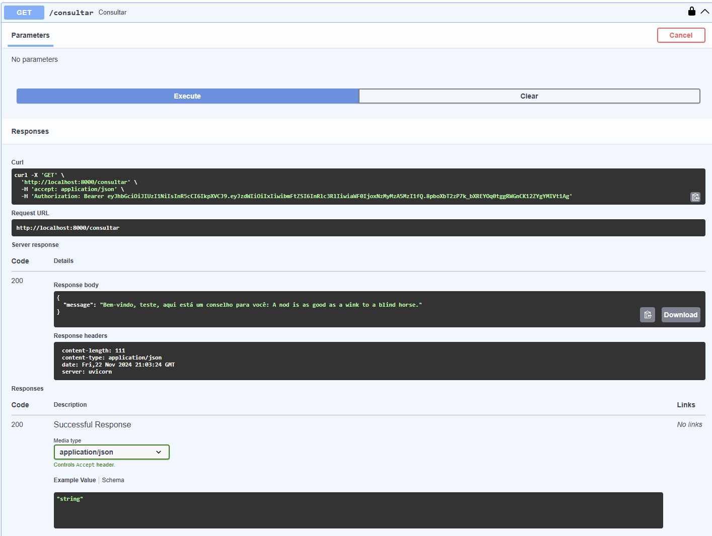

Camila Cardia Consentino

# ENTREGA 1
## *DOCKERIZING*

### explicação do projeto - scrap do que foi feito
Esta API foi construída com FastAPI e utiliza autenticação baseada em JWT. A API interage com um banco de dados PostgreSQL para gerenciar usuários (registro e login) e fornece um endpoint (protegido por autenticacao) que retorna conselhos aleatórios.

### explicação de como executar a aplicação
1. Rode no terminal, na raiz da pasta projetonuvem:
`cd app` - para entrar na pasta
`docker compose up` - para rodar o conteiner

2. Abra o link API docs
`API docs: http://0.0.0.0:8000/docs`

3. No navegador, será necessário trocar '0.0.0.0' por 'localhost' no link, para entrar na interface da FastApi

4. Para realizar registro ou login, clique na barra correspondente à ação que voce quer realizar e depois clique em `Try Out`. Preencha os campos e clique em `Execute`. 

5. Se tudo der certo, o retorno será o token JWT, copie o token retornado

6. Para consultar a API, clique no botão `Authorize` no canto direito superior. Cole o token copiado no campo disponivel e clique em `authorize`

7. Clique na barra de `GET` `\consultar`, clique em `Try Out` e então em `Execute`. Não é necessário preencher nenhum campo pois o token já foi autenticado. A resposta dessa consulta será uma mensagem

### documentação dos endpoints da API
1. `\register`

**Método**: `POST`

**Descrição**: Este endpoint permite que novos usuários sejam registrados no sistema. Durante o registro:
- O sistema verifica se o email fornecido já está cadastrado.
- A senha fornecida é criptografada antes de ser armazenada no banco de dados.
- Um token JWT é gerado e retornado como resposta.

**Parâmetros (no corpo da requisição):**
`nome` (str): Nome do usuário.
`email` (str): Email do usuário.
`senha` (str): Senha do usuário.

**Retorno:**
*Em caso de sucesso:*
`{ "jwt": "token-gerado"}`
*Erros:*
`400 Bad Request`: "Email já cadastrado" - Caso o email fornecido já exista no banco de dados.

2. `\login`

**Método**: `POST`

**Descrição**: Este endpoint autentica um usuário existente no sistema. Ele verifica o email e a senha fornecidos. Caso as credenciais estejam corretas, um token JWT é gerado e retornado.

**Parâmetros (no corpo da requisição):**
`email` (str): Email do usuário.
`senha` (str): Senha do usuário.

**Retorno:**
*Em caso de sucesso:*
`{ "jwt": "token-gerado"}`
*Erros:*
`401 Unauthorized`: "Credenciais inválidas" - Caso o email ou a senha estejam incorretos.

1. `\consultar` 

**Método**: `POST`

**Descrição**: Este endpoint é protegido e só pode ser acessado por usuários autenticados (com um token JWT válido). Ele retorna um conselho aleatório para o usuário logado.

**Autenticação:**
O token JWT deve ser incluído no cabeçalho da requisição como um Bearer Token:
`Authorization: Bearer <token-jwt>`

**Retorno:**
*Em caso de sucesso:*
`{"message": "Bem-vindo, <nome-do-usuario>, aqui está um conselho para você: <conselho-aleatório>" }`

*Erros:*
`401 Unauthorized`: "Token expirado" - Caso o token JWT tenha expirado.
`403 Forbidden`: "Token inválido" ou "Token não fornecido" - Caso o token seja inválido ou não seja fornecido.
`404 Not Found`: "Usuário não encontrado" - Caso o usuário associado ao token não seja encontrado no banco de dados.

### screenshot com os endpoints testados
/register

/login

/consultar

### video de execução DOCKER
https://drive.google.com/file/d/14TfMft3D4hzPfacRbFCedyNofXXfilUa/view?usp=sharing

### link para o docker hub do projeto
https://hub.docker.com/r/camilaconsentino/projetonuvem-camilacc5

# ENTREGA 2
## *AWS*

## explicação de como executar a aplicação
1. Rode no terminal, na raiz da pasta projetonuvem:
`kubectl get svc` - pegue o External IP 

2. Abra o link no navegador

3. No navegador, será necessário trocar adicionar '/docs' ao final do endere'co, para entrar na interface da FastApi

4. Para realizar registro ou login, clique na barra correspondente à ação que voce quer realizar e depois clique em `Try Out`. Preencha os campos e clique em `Execute`. 

5. Se tudo der certo, o retorno será o token JWT, copie o token retornado

6. Para consultar a API, clique no botão `Authorize` no canto direito superior. Cole o token copiado no campo disponivel e clique em `authorize`

7. Clique na barra de `GET` `\consultar`, clique em `Try Out` e então em `Execute`. Não é necessário preencher nenhum campo pois o token já foi autenticado. A resposta dessa consulta será uma mensagem

### documentação dos endpoints da API
Igual a etapa anterior 

### screenshot com os endpoints testados
Igual a etapa anterior

### video de execucao AWS
https://drive.google.com/file/d/15bpYgMK8EAmbWeQPMo-jv1ZERCGC6gDw/view?usp=sharing